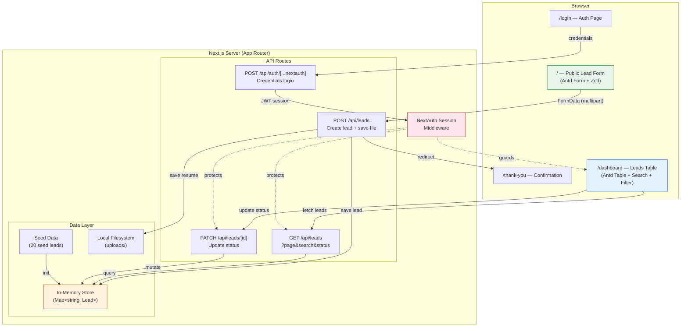
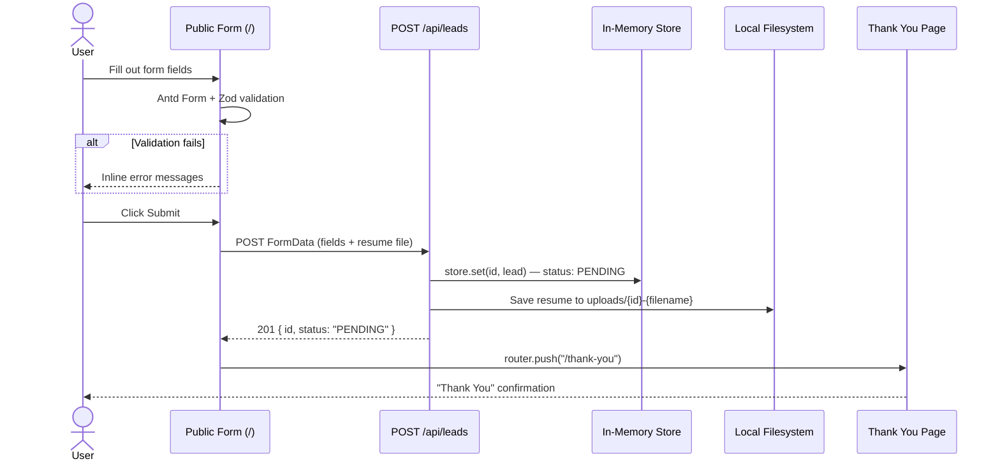
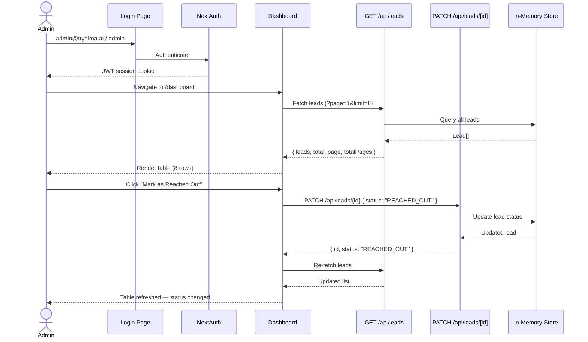

# Alma Lead Management — Take-Home Assignment

## Context
- **Company:** Alma (tryalma.ai) — immigration services platform
- **Role:** Position discussed with CTO (Shuo), leveraging AI experience
- **Deadline:** 24 hours from start
- **Submit to:** shuo@tryalma.ai with public GitHub link

---

## 1. Assignment Breakdown

### Core Requirements
| # | Feature | Priority |
|---|---------|----------|
| 1 | Public lead form (7 fields + file upload) | Must have |
| 2 | Internal leads list with auth | Must have |
| 3 | Status management (PENDING → REACHED_OUT) | Must have |
| 4 | Form validation | Must have |
| 5 | Match the mocks closely | Must have |

### Bonus Items (from assignment)
| # | Bonus | Decision | Implementation | Phase |
|---|-------|----------|---------------|-------|
| 1 | Next.js API routes | **YES** | 3 real endpoints: `POST /api/leads`, `GET /api/leads`, `PATCH /api/leads/[id]`. In-memory store — fully functional, not mocked. | Phase 2 |
| 2 | JsonForms (config-driven) | **YES — Phase 5.5** | Config-driven architecture: JSON Schema (draft-07) stored server-side, editable via Settings page, public form fetches schema dynamically. Demonstrates the concept without `@jsonforms/core` overhead. | Phase 5.5 |
| 3 | Unit tests | **YES** | 12 test cases: form rendering, validation (empty/email/URL), submit flow, table rendering, filters, status update, all 3 API endpoints. Jest + React Testing Library. | Phase 6 |
| 4 | Responsive design | **YES** | Antd responsive components + Tailwind breakpoint utilities (`md:`, `lg:`). Mobile form stacks naturally. Table horizontally scrollable on mobile. | Phase 5 |
| 5 | TypeScript | **YES** | Project scaffolded with TypeScript from start. Zod schemas infer types. `Lead` interface defined in `lib/types.ts`. | Phase 1 |
| 6 | Form validation feedback | **YES** | Antd Form built-in inline error messages per field + Zod schema for type-safe rules. Required, email format, URL format validations with real-time feedback. | Phase 3 |
| 7 | System design document | **YES** | DESIGN.md — architecture diagram, data flow, API design, trade-offs table, scaling considerations. | Phase 6 |
| 8 | State management (Redux) | **YES** | Redux Toolkit for client-side UI state (theme toggle). `createSlice`, `configureStore`, typed hooks (`useAppSelector`, `useAppDispatch`). | Post-Phase 6 |
| 9 | Server state (React Query) | **YES** | TanStack React Query for all API data. `useQuery` for fetching leads and form config, `useMutation` for status updates and config saves. Automatic caching and cache invalidation. | Post-Phase 6 |

### Tech Requirements → Implementation Mapping

| Requirement | Implementation | Phase |
|---|---|---|
| Use Next.js | Next.js 15, App Router, TypeScript | Phase 1 |
| Mock API / Bonus: API routes | Real Next.js API routes: `POST /api/leads`, `GET /api/leads`, `PATCH /api/leads/[id]`. In-memory store — fully functional, not mocked. | Phase 2 |
| Mock authentication | NextAuth.js credentials provider. Hardcoded login (admin@tryalma.ai / admin). `/dashboard` protected via session check. Real auth pattern, mock credentials. | Phase 4 |
| File upload for resume/CV | Antd `<Upload>` component (drag-and-drop + file list UI) → Next.js API route handles multipart FormData → saves to local `uploads/` directory. | Phase 2 (API) + Phase 3 (UI) |
| Form validation | Antd Form built-in rules (required, email format, URL format) + Zod schema for type-safe validation. Inline error messages per field. | Phase 3 |
| Style with CSS or CSS-in-JS | AntD CSS-in-JS via `@ant-design/cssinjs` design tokens + Tailwind CSS for layout. Dashboard light/dark theme toggle demonstrates runtime style generation — swapping token objects regenerates all component styles dynamically. | Phase 1 (setup) + Phase 3/4/5 |
| Match the mocks closely | Highest priority. Dedicated polish pass in Phase 5 for spacing, fonts, colors. Seed data matches mock exactly. | Phase 5 |

---

## 2. Mock Analysis

### Public Form (Page: `/`)

**Hero Section:**
- Dark olive/green gradient background
- 3D abstract leaf/petal decorative shapes (top-right area)
- "alma" logo in white, top-left
- "Assessment" label above logo
- Large white heading: "Get An Assessment Of Your Immigration Case"

**Form Body — 3 sections with purple/blue icons:**

**Section 1: Personal Info** (clipboard icon)
- Heading: "Want to understand your visa options?"
- Subtext: "Submit the form below and our team of experienced attorneys will review your information and send a preliminary assessment of your case based on your goals."
- Fields:
  - First Name → Antd `<Input>` | required
  - Last Name → Antd `<Input>` | required
  - Email → Antd `<Input>` | required, email format validation
  - Country of Citizenship → Antd `<Select>` with country options | required (NOTE: not in written requirements but IS in mock — including it to match mock)
  - LinkedIn / Personal Website URL → Antd `<Input>` | required, URL format validation

**Section 2: Visa Interest** (briefcase/suitcase icon)
- Heading: "Visa categories of interest?"
- → Antd `<Checkbox.Group>` | required (at least one)
- Options:
  - O-1
  - EB-1A
  - EB-2 NIW
  - I don't know

**Section 2.5: Resume Upload** (between visa interest and help message)
- → Antd `<Upload>` with drag-and-drop | required
- Accepts: .pdf, .doc, .docx
- Stored via POST to `/api/leads` as multipart FormData → saved to local `uploads/` directory
- NOTE: Not clearly visible in mock but explicitly required in assignment. Placed here as logical position.

**Section 3: Additional Info** (heart icon)
- Heading: "How can we help you?"
- → Antd `<Input.TextArea>` with large rows | required
- This is the "Open long input" from requirements

**Submit:**
- Black pill-shaped button, centered: "Submit"
- → Antd `<Button type="primary" htmlType="submit">` with theme override for pill shape (borderRadius: 9999)

**Confirmation Page (after submit — `/thank-you`):**
- Clean white page, centered
- Purple/blue checkmark icon
- "Thank You" heading (bold)
- "Your information was submitted to our team of immigration attorneys. Expect an email from hello@tryalma.ai"
- Black pill button: "Go Back to Homepage" → links to `/`

**Field-to-Requirement Mapping:**
| Assignment Requirement | Mock Label | Component | Validation |
|---|---|---|---|
| First Name | First Name | `<Input>` | required |
| Last Name | Last Name | `<Input>` | required |
| Email | Email | `<Input>` | required, email format |
| Linkedin | LinkedIn / Personal Website URL | `<Input>` | required, URL format |
| Visas that you're interested | Visa categories of interest? | `<Checkbox.Group>` | required (min 1) |
| Resume / CV (file upload) | (not in mock, add section) | `<Upload>` | required, .pdf/.doc/.docx |
| Open long input | How can we help you? | `<Input.TextArea>` | required |
| — (mock only) | Country of Citizenship | `<Select>` | required |
| Confirmation message | Thank You page | `/thank-you` route | — |

### Internal Leads List (Page: `/dashboard`)

**Sidebar (dark/black, left):**
- "Admin View" small label at top
- "alma" logo below
- Nav links:
  - "Leads" (active/current)
  - "Settings"
- Bottom of sidebar: circle avatar "A" + "Admin" text

**Main Content:**
- "Leads" heading (large, bold)
- Toolbar: Search input (with magnifying glass icon) + Status dropdown filter
- Table:
  - Columns (all with sort arrows ↓): Name, Submitted, Status, Country
  - Date format: `MM/DD/YYYY, H:MM PM`
  - Status values: "Pending" (black text) / "Reached Out" (black text)
  - Clean row separators, no zebra striping
- Pagination at bottom-right: `< 1 2 3 >`
- 8 rows visible per page

**Sample Data from Mock:**
| Name | Submitted | Status | Country |
|------|-----------|--------|---------|
| Jorge Ruiz | 02/02/2024, 2:45 PM | Pending | Mexico |
| Bahar Zamir | 02/02/2024, 2:45 PM | Pending | Mexico |
| Mary Lopez | 02/02/2024, 2:45 PM | Pending | Brazil |
| Li Zijin | 02/02/2024, 2:45 PM | Pending | South Korea |
| Mark Antonov | 02/02/2024, 2:45 PM | Pending | Russia |
| Jane Ma | 02/02/2024, 2:45 PM | Pending | Mexico |
| Anand Jain | 02/02/2024, 2:45 PM | Reached Out | Mexico |
| Anna Voronova | 02/02/2024, 2:45 PM | Pending | France |

**Requirement-to-Implementation Mapping:**

| Assignment Requirement | Implementation | Component |
|---|---|---|
| Internal UI guarded by authentication | NextAuth.js session check. Unauthenticated users redirected to `/login`. | Phase 4 — middleware or layout-level session guard |
| Display list of leads with **all** information | Table shows 4 summary columns (matching mock). Click row → expandable detail or drawer showing ALL fields (email, LinkedIn, visa interests, resume download, help message). | Antd `<Table expandable>` or Antd `<Drawer>` on row click |
| State starts as PENDING | Default status in seed data and API POST response. | `status: "PENDING"` in store + API |
| Manually transition PENDING → REACHED_OUT | Explicit button per row. Two options: (a) button in a 5th "Action" column, or (b) clickable status cell. Going with **(a) Action column with button** since requirement explicitly says "Include a button". | Antd `<Button size="small">` in table Action column — only visible when status is PENDING |
| Match the mock | Table: 4 visible columns + Action column for status button. Sidebar, search, filter, pagination all match mock layout. | Phase 5 polish |

**Design decision — "all the information" vs mock:**
The mock only shows 4 columns (Name, Submitted, Status, Country), but the requirement says "display a list of leads with all the information filled in by the prospect." Resolution:
- **Table view** = 4 summary columns + Action button (matches mock)
- **Expanded/detail view** = shows remaining fields (email, LinkedIn, visa interests, resume file, help message)
- This satisfies both "match the mock" AND "all the information"

**Observations:**
- Search filters by name (client-side on fetched data)
- Status dropdown filters by Pending/Reached Out/All
- Pagination: 8 rows per page, matching mock
- Action button shows "Mark as Reached Out" only for PENDING leads. Once REACHED_OUT, show disabled/greyed text or no button.

---

## 3. Architecture Decisions

### Tech Stack

| Layer | Choice | Why |
|-------|--------|-----|
| Framework | Next.js 15 (App Router) | Required. App Router is current standard. |
| Language | TypeScript | Bonus points + type safety |
| UI Library | AntD | Production-grade Table, Form, Upload components. Built-in sorting, pagination, validation. Design tokens for theme customization. Prior experience = faster delivery. |
| Styling | Ant Design tokens + Tailwind CSS (utility) | Antd ConfigProvider for component theming (black buttons, minimal borders). Tailwind for layout utilities and custom sections (hero, form sections) where antd components don't apply. |
| Form handling | Ant Design Form + Zod | Antd Form has built-in validation UX, field-level error messages, and all input types needed (Input, Select, Checkbox.Group, Upload, TextArea). Zod for schema definition. |
| API | Next.js API routes | Bonus points, keeps it self-contained |
| Storage | In-memory store (Map) | Take-home scope — no need for a real DB. Data persists during server lifetime. |
| Auth | NextAuth.js with credentials provider | Real auth pattern with mock credentials (admin@tryalma.ai / admin) |
| Client state | Redux Toolkit | Theme toggle, typed hooks. Scalable pattern for UI state. |
| Server state | TanStack React Query | Leads list, form config. Caching, background refetch, cache invalidation. |
| Testing | Jest + React Testing Library | Standard for Next.js |
| File upload | Antd Upload + Next.js API route + local filesystem | Antd Upload gives drag-and-drop + file list UI. API route saves to local fs. |

### Why these choices:

**AntD over raw Tailwind/styled-components:**
- `<Table>` component solves 60% of the dashboard: sorting, pagination, column config, search — all built-in and matching the mock's table pattern
- `<Form>` component handles validation UX (error messages, required fields, field-level feedback) without manual wiring
- `<Upload>` component provides file upload with progress and file list display
- Design tokens via `ConfigProvider` allow customizing to match Alma's minimal aesthetic (black buttons, clean borders) without fighting the library
- Prior hands-on experience with AntD = faster delivery within 24hr deadline
- Relevant to Alma's domain: immigration platforms need many form types at scale — a component library with built-in form patterns is the right production choice

**Tailwind CSS as complement (not replacement):**
- Used for the hero section, form section layouts with icons, and custom spacing — areas where antd components don't apply
- Responsive utilities (`md:`, `lg:`) for mobile adaptation
- Co-exists cleanly with antd via `tailwind-antd` prefix config to avoid class conflicts

### Why NOT these alternatives:
- **SQLite/Prisma** — overkill for a take-home, adds setup complexity
- **JsonForms** — config-driven form rendering. No official Antd renderer set — requires writing custom renderers mapping JsonForms controls to Antd components. Planned as optional Phase 5.5 refactor if time allows. In production, eliminates dev cycles for form changes (non-engineers edit JSON config instead of React code). Highly relevant for Alma's domain where different visa types need different forms and immigration law changes frequently.
- **styled-components** — AntD already provides component-level theming via design tokens. Adding styled-components on top would be redundant. Tailwind handles the remaining layout needs.
- **Raw Tailwind only** — would require building Table (sorting, pagination), Form (validation, error states), Upload (file handling) from scratch. Antd provides these production-ready.

### Project Structure

```
alma-take-home-assignment/
├── src/
│   ├── app/
│   │   ├── page.tsx                    # Public lead form
│   │   ├── thank-you/page.tsx          # Confirmation after submit
│   │   ├── login/page.tsx              # Login page (admin@tryalma.ai / admin)
│   │   ├── dashboard/
│   │   │   ├── layout.tsx              # Redux + React Query + auth guard
│   │   │   ├── page.tsx                # Leads table
│   │   │   └── settings/page.tsx       # Form config (JSON Schema editor)
│   │   ├── api/
│   │   │   ├── leads/route.ts          # GET (auth) + POST (public)
│   │   │   ├── leads/[id]/route.ts     # PATCH (auth)
│   │   │   ├── form-config/route.ts    # GET (public) + PUT (auth)
│   │   │   └── auth/[...nextauth]/     # NextAuth handler
│   │   └── layout.tsx                  # Root layout
│   ├── components/
│   │   ├── LeadForm.tsx                # Public form (3 sections + upload)
│   │   ├── LeadsTable.tsx              # Dashboard table + mobile cards
│   │   └── Sidebar.tsx                 # Dashboard sidebar + theme toggle
│   ├── lib/
│   │   ├── types.ts                    # TypeScript interfaces
│   │   ├── schema.ts                   # Zod validation schemas
│   │   ├── store.ts                    # In-memory leads store
│   │   ├── seed.ts                     # 20 seed leads
│   │   ├── auth.ts                     # NextAuth config
│   │   ├── theme.ts                    # AntD theme tokens (light + dark)
│   │   ├── formConfigStore.ts          # JSON Schema config store
│   │   └── redux/
│   │       ├── store.ts                # Redux store (configureStore)
│   │       ├── hooks.ts                # Typed useAppSelector/useAppDispatch
│   │       └── themeSlice.ts           # Theme state (light/dark toggle)
│   └── __tests__/
│       ├── api/
│       │   ├── leads.test.ts           # Store CRUD tests
│       │   ├── schema.test.ts          # Validation tests
│       │   └── formConfig.test.ts      # Form config store tests
│       └── components/
│           ├── LeadForm.test.tsx        # Form rendering tests
│           └── LeadsTable.test.tsx      # Table rendering tests
├── APPROACH.md                         # This file — full approach notes
├── DESIGN.md                           # System design document (for submission)
├── README.md                           # How to run locally
└── package.json
```

### API Design

```
POST   /api/leads          — Create a new lead (from public form)
  Body: FormData (multipart — includes file upload)
  Returns: { id, status: "PENDING" }

GET    /api/leads           — List all leads (auth required)
  Query: ?page=1&limit=8&search=&status=
  Returns: { leads: [...], total, page, totalPages }

PATCH  /api/leads/[id]      — Update lead status (auth required)
  Body: { status: "REACHED_OUT" }
  Returns: { id, status }
```

### Data Model

```typescript
interface Lead {
  id: string;
  firstName: string;
  lastName: string;
  email: string;
  country: string;
  linkedIn: string;
  visaInterests: string[];         // ["O-1", "EB-1A", "EB-2 NIW", "I don't know"]
  resumePath: string | null;       // file path on server
  resumeFileName: string | null;   // original file name
  helpMessage: string;             // "How can we help you?"
  status: "PENDING" | "REACHED_OUT";
  submittedAt: Date;
}
```

### Seed Data
Pre-populate with 20 seed leads — the original 8 from the mock (Jorge Ruiz, Bahar Zamir, etc.) plus 12 additional leads for realistic pagination. Anand Jain and select others get status "REACHED_OUT", rest are "PENDING".

---

## 4. Implementation Plan

### Phase 1: Project Setup (~15 min)
- [ ] `npx create-next-app` with TypeScript + Tailwind + App Router
- [ ] Install antd, @ant-design/icons
- [ ] Configure antd ConfigProvider with custom theme tokens (black primary, minimal borders)
- [ ] Set up project structure (folders, types, schema)
- [ ] Initialize git repo
- [ ] Add seed data

### Phase 2: API Routes (~30 min)
- [ ] In-memory store with seed data
- [ ] POST /api/leads (create, handle file upload)
- [ ] GET /api/leads (list with pagination, search, status filter)
- [ ] PATCH /api/leads/[id] (status update)

### Phase 3: Public Lead Form (~1.5 hr)
- [ ] Hero section (olive/green gradient + heading — Tailwind for layout)
- [ ] Form sections with purple icons and headings
- [ ] Antd Form: Input (name, email, LinkedIn), Select (country), Checkbox.Group (visas), Upload (resume), TextArea (help)
- [ ] Zod schema wired to Antd Form rules for validation feedback
- [ ] Submit → POST to API → redirect to thank-you page
- [ ] Thank-you confirmation page
- [ ] Theme overrides: pill-shaped button, thin input borders to match mock

### Phase 4: Dashboard (~1.5 hr)
- [ ] NextAuth setup with mock credentials (admin@tryalma.ai / admin)
- [ ] Login page (`/login`)
- [ ] Auth guard: unauthenticated users redirected to `/login`
- [ ] Sidebar component (nav + user — Tailwind layout, dark bg)
- [ ] Antd Table: columns Name, Submitted, Status, Country with built-in sorters
- [ ] Action column: "Mark as Reached Out" `<Button>` per row (only shown for PENDING leads) — satisfies "Include a button to change the state"
- [ ] Row expand or Drawer on row click → shows ALL lead info (email, LinkedIn, visa interests, resume download link, help message) — satisfies "display all the information"
- [ ] Antd Input.Search for name filtering
- [ ] Antd Select for status filter dropdown (All / Pending / Reached Out)
- [ ] Antd Table pagination (8 per page)
- [ ] PATCH `/api/leads/[id]` call on button click → update status → refresh table

### Phase 5: Polish (~1 hr)
- [ ] Responsive design check (mobile form, mobile table)
- [ ] Loading states
- [ ] Error handling
- [ ] Match mock styling precisely (spacing, fonts, colors)

### Phase 5.5: Config-Driven Form (JsonForms Bonus) (~1 hr)
**Strategy:** Rather than installing `@jsonforms/core` and building custom AntD renderers (2+ hours, zero visual change), demonstrate the config-driven concept with a lightweight approach: the lead form's structure is defined as a JSON Schema (draft-07), stored server-side, and editable via the Settings page.

- [x] In-memory JSON Schema config store (`src/lib/formConfigStore.ts`) — builds default schema from existing `COUNTRIES` and `VISA_OPTIONS` arrays
- [x] API routes (`src/app/api/form-config/route.ts`) — `GET` (public) returns active schema, `PUT` (auth required) validates and updates
- [x] Settings page (`src/app/dashboard/settings/page.tsx`) — JSON Schema editor with live editing, validation, and save
- [x] LeadForm dynamic country list — fetches `/api/form-config` on mount, extracts `country.enum`, falls back to hardcoded `COUNTRIES`
- [x] Tests (`src/__tests__/api/formConfig.test.ts`) — 6 tests covering CRUD, cloning, and schema structure
- [x] Updated LeadForm tests — added `global.fetch` mock for the config fetch on mount

**Why this approach over full JsonForms:** Installing `@jsonforms/core` + writing 6 custom AntD renderers = 2+ hours of work with zero visual change. The lighter approach demonstrates the same config-driven architecture (schema → API → dynamic form) without the library overhead. Documented in DESIGN.md as a conscious trade-off.

### Phase 6: Documentation + Tests (~1 hr)
- [ ] Unit tests for form validation + leads table
- [ ] DESIGN.md (system design document)
- [ ] README.md (setup instructions)
- [ ] Final review of APPROACH.md

### Phase 7: Submit (~15 min)
- [ ] Push to public GitHub repo
- [ ] Verify clone + run works from scratch
- [ ] Email shuo@tryalma.ai

---

## 5. Development Workflow

### Git Strategy
- **Single branch:** `main` — no feature branches for a solo 24-hour sprint
- **Frequent commits:** commit after each phase completion (verifiable progress)
- **Commit message format:** `Phase X: description` (e.g., `Phase 1: project setup with AntD + tailwind`)
- **No force pushes** — clean linear history

### Development Order & Dependencies

```
Phase 1 (Setup) → Phase 2 (API) → Phase 3 (Form) → Phase 4 (Dashboard)
                                                          ↓
                                              Phase 5 (Polish)
                                                  ↓            ↘
                                        Phase 5.5 (JsonForms)   Phase 6 (Tests + Docs)
                                          [OPTIONAL]                  ↓
                                                              Phase 7 (Submit)
```

- **Phase 1 → 2:** API before UI — form and dashboard need endpoints to hit
- **Phase 3 and 4 are independent** of each other (both consume API), but doing form first because it's the public-facing page and simpler
- **Phase 5 (Polish) after both screens work** — easier to tune spacing/colors when layout is stable
- **Phase 5.5 (JsonForms) only if Phase 5 finishes early** — safe refactor since Antd form already works
- **Phase 6 (Tests + Docs) after polish** — tests lock down final behavior, docs reflect final state

### Dev Server Workflow
- `npm run dev` running throughout
- Browser open with both `/` (form) and `/dashboard` (leads table)
- Manual verification after each phase before committing

### Environment Variables
- **Zero-config approach:** NextAuth secret has a hardcoded fallback in code (`"alma-take-home-demo-secret"`), so no `.env` setup is needed
- `.env.example` shipped for documentation only — not required to run
- `NEXTAUTH_URL` defaults to `http://localhost:3000` in dev mode (Next.js auto-detects)

```typescript
// src/lib/auth.ts
secret: process.env.NEXTAUTH_SECRET || "alma-take-home-demo-secret"
```

### Quick Start
```bash
git clone https://github.com/kimo/alma-take-home-assignment.git
cd alma-take-home-assignment
npm install
npm run dev
```
- **Zero config.** No `.env` setup, no database, no Docker.
- Open `http://localhost:3000` → public lead form
- Go to `/dashboard` → redirected to login
- Login: `admin@tryalma.ai` / `admin`
- Dashboard pre-loaded with 20 seed leads (8 from mock + 12 additional for pagination)

---

## 6. Testing Strategy

### What We Test (and Why)

| Test | Type | What It Verifies | Priority |
|------|------|-----------------|----------|
| Lead form renders all fields | Component | All 7+ fields present and correct types | High |
| Form validation — empty submit | Component | Error messages appear for all required fields | High |
| Form validation — invalid email | Component | Email format validation triggers | High |
| Form validation — invalid URL | Component | LinkedIn URL format validation triggers | Medium |
| Form submit → API call | Integration | FormData posted correctly to /api/leads | High |
| Leads table renders seed data | Component | Seed leads display correctly | High |
| Status filter works | Component | Filtering by Pending/Reached Out updates table | Medium |
| Search filter works | Component | Name search filters table rows | Medium |
| "Mark as Reached Out" button | Integration | PATCH call + table updates status | High |
| API: POST /api/leads | Unit | Creates lead, returns id + PENDING status | High |
| API: GET /api/leads | Unit | Returns paginated leads with filters | Medium |
| API: PATCH /api/leads/[id] | Unit | Updates status correctly | High |

### What We Don't Test (conscious trade-off for 24hr deadline)
- **Auth flow** — NextAuth is well-tested library, mock credentials are simple
- **File upload end-to-end** — would need mocking filesystem; manual verification sufficient
- **CSS/visual regression** — no snapshot testing, manual visual check against mocks
- **Accessibility** — Antd components have built-in a11y; no additional a11y testing

### Test Stack
- **Jest** — test runner (ships with create-next-app)
- **React Testing Library** — component rendering + user interaction
- **@testing-library/user-event** — realistic user events (typing, clicking)
- **jest-environment-jsdom** — DOM environment for component tests

### Test File Structure
```
src/__tests__/
├── api/
│   ├── leads.test.ts             # Store CRUD operations + seed data (11 tests)
│   ├── schema.test.ts            # Zod validation for leads + status (7 tests)
│   └── formConfig.test.ts        # JSON Schema config store (6 tests)
└── components/
    ├── LeadForm.test.tsx          # Form rendering + fields + upload (7 tests)
    └── LeadsTable.test.tsx        # Table rendering + fetch + filters (9 tests)
```

**Total: 40 tests across 5 suites.**

### Running Tests
```bash
npm test                  # run all tests
npm test -- --coverage    # with coverage report
npm test -- --watch       # watch mode during development
```

### Coverage Target
- Aim for **meaningful coverage** of core paths, not a percentage target
- All form fields validated, all API endpoints covered, table interactions tested
- Skip covering boilerplate (layout, providers, config)

---

## 7. Release Plan

### Pre-Submission Checklist

**Functional Verification:**
- [ ] Fresh `git clone` → `npm install` → `npm run dev` works on first try
- [ ] Public form at `/` — all fields render, validation works, submit creates lead
- [ ] Thank-you page at `/thank-you` — shows confirmation, "Go Back" works
- [ ] Login at `/login` — admin@tryalma.ai / admin credentials work
- [ ] Dashboard at `/dashboard` — table shows seed data, all 4 columns sort
- [ ] Search by name filters correctly
- [ ] Status dropdown filter works (All / Pending / Reached Out)
- [ ] "Mark as Reached Out" button updates status
- [ ] Row expand/drawer shows all lead info (email, LinkedIn, visas, resume, help message)
- [ ] Pagination works (8 per page)
- [ ] File upload accepts .pdf/.doc/.docx
- [ ] Unauthenticated access to `/dashboard` redirects to login
- [ ] Settings page at `/dashboard/settings` — JSON Schema editor loads, saves, updates country dropdown
- [ ] Light/dark theme toggle works in dashboard sidebar
- [ ] `npm test` passes with no failures (40 tests across 5 suites)
- [ ] `npm run build` succeeds with no errors

**Visual Verification (vs mocks):**
- [ ] Hero section: green gradient, heading text, decorative elements
- [ ] Form: 3 sections with icons, proper field layout
- [ ] Submit button: black, pill-shaped, centered
- [ ] Dashboard sidebar: dark bg, "alma" logo, nav items, avatar
- [ ] Table: clean rows, sort arrows, date format matches
- [ ] Pagination style matches mock
- [ ] Thank-you page: checkmark icon, text, button

**Code Quality:**
- [ ] No TypeScript errors (`npx tsc --noEmit`)
- [ ] No ESLint warnings (`npm run lint`)
- [ ] No hardcoded secrets (only in .env.local, not committed)
- [ ] .env.example committed with placeholder values
- [ ] No `console.log` left in production code
- [ ] File uploads directory gitignored

**Documentation:**
- [ ] README.md — clear setup instructions (3 commands: clone, install, run)
- [ ] README.md — login credentials documented
- [ ] README.md — tech stack and key decisions summarized
- [ ] DESIGN.md — system design document (architecture diagram, data flow, trade-offs)
- [ ] APPROACH.md — this file, clean and complete

### Submission Steps
1. **Make repo public:** `gh repo edit kimo/alma-take-home-assignment --visibility public`
2. **Verify public access:** open `https://github.com/kimo/alma-take-home-assignment` in incognito
3. **Final local test:** clone into temp dir, install, run, verify everything works
4. **Email to shuo@tryalma.ai:**
   - Subject: `Take-Home Assignment — Krishna Guda`
   - Body: link to public GitHub repo
   - Mention: APPROACH.md for planning process, DESIGN.md for system design, README.md for setup
5. **Keep repo public** until hearing back

### Timeline Budget (24 hours)

| Phase | Estimated | Cumulative | Deliverable |
|-------|-----------|-----------|-------------|
| 1. Setup | 15 min | 0:15 | Project scaffolded, antd + tailwind configured |
| 2. API Routes | 30 min | 0:45 | All 3 endpoints working (test via curl) |
| 3. Public Form | 1.5 hr | 2:15 | Form submits, validation works, thank-you page |
| 4. Dashboard | 1.5 hr | 3:45 | Table, search, filter, pagination, status button, detail view |
| 5. Polish | 1 hr | 4:45 | Pixel-perfect match to mocks, responsive |
| 5.5. Config-Driven Form | 1 hr | 5:45 | JSON Schema config store, Settings editor, dynamic country list |
| 6. Tests + Docs | 1 hr | 6:45 | 40 tests pass, README, DESIGN.md complete |
| 7. Submit | 15 min | 7:00 | Public repo, email sent |

**Total:** ~7 hours including config-driven form bonus. Plenty of buffer within 24hr deadline.

**Risk mitigation:** If any phase takes longer than estimated, skip Phase 5.5 (JsonForms) first, then reduce test coverage. Core functionality + mock match + documentation are non-negotiable.

---

## 8. Progress Log

### Planning Phase
- Analyzed assignment requirements and both mockups in detail (field-by-field)
- Created field-to-requirement mapping for both screens
- Identified gap: "all information" requirement vs 4-column mock → resolved with expandable rows
- Made architecture decisions and documented trade-offs

### Phase 1–4: Core Implementation
- Project scaffolded with Next.js 15, AntD, Tailwind CSS, TypeScript
- 3 API routes: `POST /api/leads`, `GET /api/leads`, `PATCH /api/leads/[id]`
- In-memory store with 20 seed leads
- Public lead form with 3 sections, Zod validation, file upload, thank-you page
- Dashboard with table, search, status filter, pagination, expandable row details
- NextAuth credentials provider, auth guard on dashboard
- Sidebar with navigation and user avatar
- Mobile-responsive card view for small screens

### Phase 5: Polish
- Color-coded status badges (yellow for Pending, green for Reached Out)
- Light/dark theme toggle via AntD `ConfigProvider` + `@ant-design/cssinjs` — demonstrates CSS-in-JS
- Context-aware `message` API via AntD `App.useApp()` hook (respects dynamic theme)

### Phase 5.5: Config-Driven Form (JsonForms Bonus)
- JSON Schema (draft-07) config store with default schema built from existing constants
- `GET /api/form-config` (public) + `PUT /api/form-config` (auth) API routes
- Settings page: JSON Schema editor with live editing, validation, save
- Public form dynamically fetches country dropdown from config (falls back to hardcoded list)
- 6 new tests for config store

### State Management: Redux Toolkit + React Query
- **Redux Toolkit** for client-side UI state: theme toggle (`themeSlice`), typed hooks (`useAppSelector`, `useAppDispatch`)
- **TanStack React Query** for server state: leads list (`useQuery`), status updates (`useMutation`), form config fetch/save
- Clean separation: Redux owns what the server doesn't know about (UI preferences), React Query owns what comes from APIs
- Dashboard layout provides both `Provider` (Redux) and `QueryClientProvider` (React Query)
- Public form page also wrapped with `QueryClientProvider` for config-driven country dropdown
- All components refactored: `LeadsTable`, `Sidebar`, `Settings`, `LeadForm`
- Tests updated with provider wrappers (`renderWithProviders` helper)

### Phase 6: Tests + Documentation
- 40 tests across 5 suites — all passing
- Store CRUD (11), Zod validation (7), Form config (6), LeadForm (7), LeadsTable (9)
- DESIGN.md: architecture diagrams, data flow, trade-offs, scaling considerations
- README.md: quick start, routes, API endpoints, test instructions, project structure
- APPROACH.md: full planning process and implementation log

### Final State
- `npm test` — 40 tests pass
- `npm run build` — clean build, all routes registered
- `npm run lint` — no errors

---

## 9. Architecture Diagrams (for DESIGN.md)

### System Component Diagram



### Data Flow — Lead Submission



### Data Flow — Dashboard Status Update



---

## 10. Design Trade-offs (for DESIGN.md later)

| Decision | Chose | Over | Why |
|----------|-------|------|-----|
| App Router | Next.js App Router | Pages Router | Modern standard, better server components |
| UI Library | AntD | Raw components | Production-grade Table, Form, Upload — solves both screens with built-in sorting, pagination, validation. Prior experience. Relevant to Alma's form-heavy domain. |
| Styling | Antd tokens + Tailwind | styled-components / Tailwind-only | Antd tokens for component theming, Tailwind for layout and custom sections (hero). Best of both. |
| Storage | In-memory Map | SQLite/Prisma | Zero setup required, sufficient for demo |
| Auth | NextAuth credentials | Custom JWT | Real auth library, production pattern |
| Validation | Antd Form rules + Zod | react-hook-form | Antd Form has native validation UX (inline errors, required marks). Zod defines the schema. No need for a third form library. |
| File upload | Antd Upload + local fs | Custom dropzone + S3 | Antd Upload gives drag-and-drop + file list UI. Local fs for demo scope. |
| Testing | Component + API tests | E2E (Cypress/Playwright) | Component tests give fast feedback. E2E adds setup overhead for a 24hr take-home with 2 screens. |
| Detail view | Expandable rows | Separate detail page | Keeps user in table context, less navigation. Satisfies "all information" requirement without leaving the mock's layout. |
| CSS-in-JS | AntD design tokens | styled-components / CSS modules | AntD `ConfigProvider` + `@ant-design/cssinjs` generates component styles at runtime from token objects. Dashboard light/dark toggle demonstrates this: flipping React state swaps the token object and cssinjs regenerates styles dynamically. |
| Config-driven forms | JSON Schema + Settings editor | Full JsonForms library | Form structure defined as JSON Schema, stored server-side, editable via Settings. Public form fetches schema for country dropdown. Same concept as JsonForms — lighter footprint, no custom renderers needed. |
| Client state | Redux Toolkit | React Context | `createSlice` for theme toggle. Typed hooks, devtools, scalable pattern for future UI state. |
| Server state | TanStack React Query | Manual fetch + useState | `useQuery` + `useMutation` for all API data. Caching, background refetch, cache invalidation — eliminates manual fetch boilerplate. |
