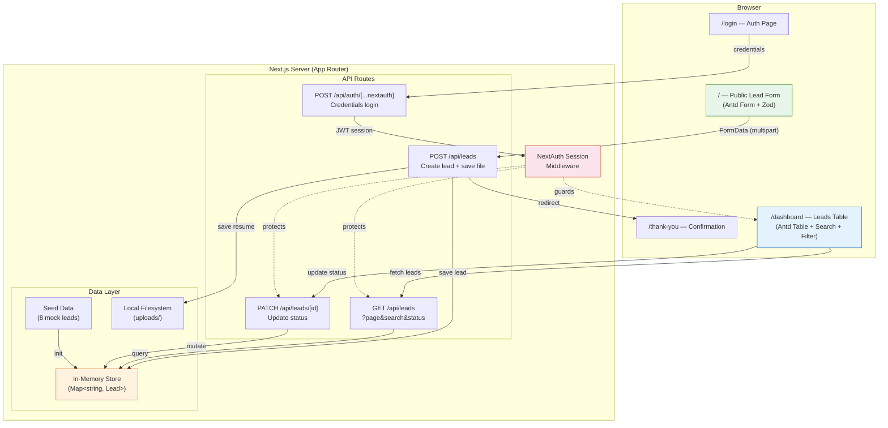
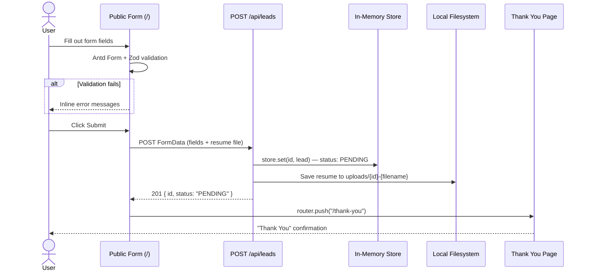
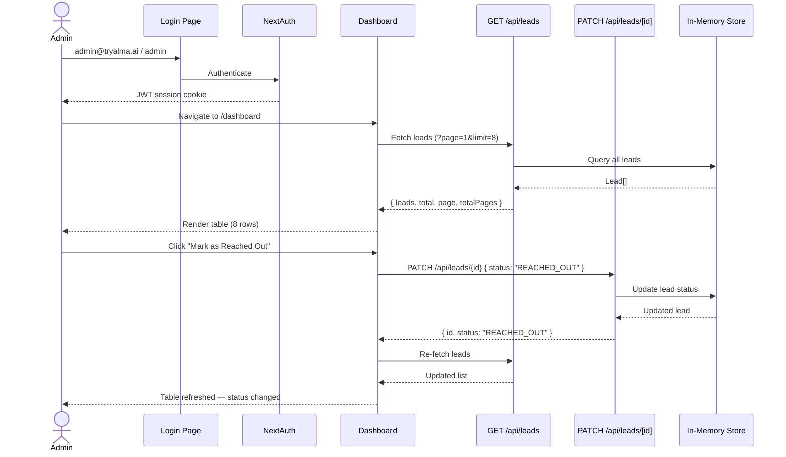

# System Design Document

## Overview

This application handles two user flows:

1. **Public prospects** submit visa assessment requests via a form
2. **Internal admins** review and manage leads through an authenticated dashboard

The system is a self-contained Next.js application with no external dependencies beyond npm packages.

---

## Architecture

### System Component Diagram



### Data Flow — Lead Submission



### Data Flow — Dashboard Status Update



---

## Data Model

```typescript
interface Lead {
  id: string;
  firstName: string;
  lastName: string;
  email: string;
  country: string;
  linkedIn: string;
  visaInterests: string[];        // ["O-1", "EB-1A", "EB-2 NIW", "I don't know"]
  resumePath: string | null;      // server file path
  resumeFileName: string | null;  // original file name
  helpMessage: string;
  status: "PENDING" | "REACHED_OUT";
  submittedAt: string;            // ISO 8601
}
```

### Storage

The data layer uses an in-memory `Map<string, Lead>` initialized with 8 seed records that match the assignment mocks. This is appropriate for the demo scope — data persists for the lifetime of the server process.

---

## API Design

| Method | Endpoint | Auth | Purpose |
|--------|----------|------|---------|
| `POST` | `/api/leads` | Public | Create lead from form submission (multipart FormData) |
| `GET` | `/api/leads` | Required | List leads with pagination, search, and status filter |
| `PATCH` | `/api/leads/[id]` | Required | Transition lead status from PENDING to REACHED_OUT |

### Query Parameters (GET)

| Param | Type | Default | Description |
|-------|------|---------|-------------|
| `page` | number | 1 | Page number |
| `limit` | number | 8 | Items per page |
| `search` | string | "" | Filter by name (case-insensitive substring match) |
| `status` | string | "" | Filter by status (PENDING or REACHED_OUT) |

---

## Authentication

NextAuth.js with a credentials provider. Mock login (hardcoded `admin@tryalma.ai` / `admin`) with JWT session strategy. The NextAuth secret has a hardcoded fallback so the reviewer needs zero configuration.

The dashboard layout checks for an active session and redirects unauthenticated users to `/login`.

---

## Design Trade-offs

| Decision | Chose | Over | Rationale |
|----------|-------|------|-----------|
| UI Library | Ant Design 5 | Raw components / Tailwind-only | Table, Form, Upload components solve both screens out of the box. Built-in sorting, pagination, validation. Prior experience enables faster delivery. |
| Styling | Antd tokens + Tailwind | styled-components | Antd `ConfigProvider` handles component theming. Tailwind handles layout and custom sections (hero). No redundancy. |
| Storage | In-memory Map | SQLite / Prisma | Zero setup for reviewer. Sufficient for demo scope. |
| State management | Antd internal + fetch | Redux | Antd Table and Form manage their own UI state. Server state is simple fetch + useState. Redux adds boilerplate with no benefit at this scale. |
| Validation | Antd Form rules + Zod | react-hook-form | Antd Form has native validation UX (inline errors, required marks). Zod defines the type-safe schema. |
| Detail view | Expandable table rows | Separate detail page | Keeps admin in table context. Click a row to see all lead info (email, LinkedIn, visas, resume, message) without navigation. Satisfies "display all information" while matching the table-centric mock. |
| Auth | NextAuth credentials | Custom JWT | Real auth library with production patterns. Minimal code for mock credentials. |
| Testing | Unit + integration | E2E (Cypress/Playwright) | Component and store tests give fast feedback with minimal setup. E2E adds overhead disproportionate to a 2-screen demo app. |
| File upload | Antd Upload + local fs | S3 / custom dropzone | Antd Upload provides drag-and-drop UI. Local filesystem for demo scope. |

---

## Scaling Considerations

If this were a production system, the following changes would apply:

| Concern | Current | Production |
|---------|---------|-----------|
| Storage | In-memory Map | PostgreSQL with Prisma ORM |
| Auth | Hardcoded credentials | OAuth providers (Google, etc.) with proper secrets |
| File storage | Local filesystem | S3 / Cloud Storage with signed URLs |
| Search | Linear scan in memory | Full-text search (PostgreSQL `tsvector` or Elasticsearch) |
| Status workflow | Binary (PENDING → REACHED_OUT) | State machine with audit trail |
| API protection | Session check | Rate limiting, CORS, input sanitization |
| Deployment | `npm run dev` | Vercel / Docker with CI/CD |
| Monitoring | Console logs | Structured logging, error tracking (Sentry) |
